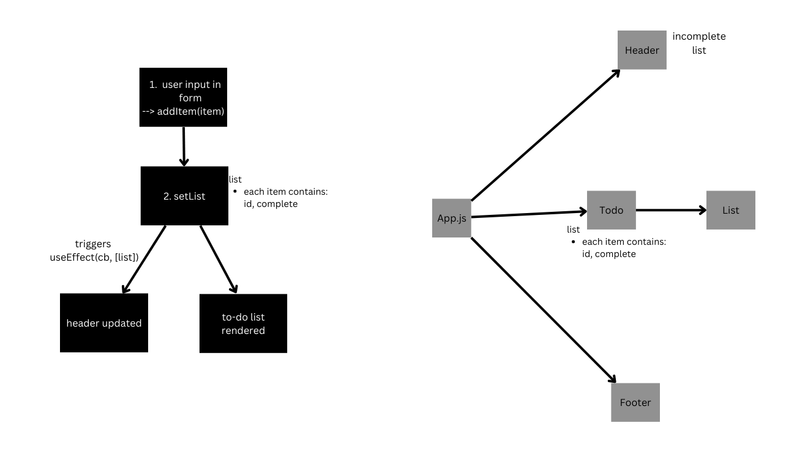

# ToDo App

This is a simple to-do list application built with React and utilizing the Context Hook for state management. The app allows users to create, update, and delete tasks, as well as mark them as completed. It provides a clean and intuitive user interface, making it easy to manage your daily tasks effectively.

## Features

Add Tasks: Users can add new tasks to their to-do list by entering the task description and pressing the "Add" button.

Update Tasks: Users can edit existing tasks by clicking on the task description, updating it, and pressing the "Save" button.

Complete Tasks: Users can mark tasks as completed by clicking the checkbox next to each task. Completed tasks are visually distinguished from active tasks.

Delete Tasks: Users can remove tasks from the list by clicking the trash icon next to each task.

## UML

## Installation

To run the application locally, follow these steps:

1. Clone the repository:
2. npm install
3. npm start
This will start the app and open it in your default browser. If it doesn't open automatically, you can access it at http://localhost:3000

## Deployed site with Netlify

#### [Deployed site](https://deploy-preview-4--preeminent-granita-53147e.netlify.app/)